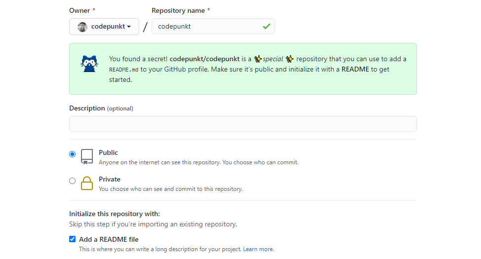

## Why READMEs?

README files are added to a repository to communicate important information about your project. They are usually the first thing a visitor will see when visiting a repository and a core part of well-documented open-source software.

GitHub released the profile READMEs feature in the middle of 2020. A profile READMEs is a nice way to share information about yourself with the community and is shown at the top of your profile page, above pinned repositories and other information. My current profile README displayed on my GitHub profile at the time of writing this article looks like this:

<a href="https://github.com/codepunkt" target="_blank" rel="noopener noreferrer">


</a>

## Creating a profile README

To create a profile README

1. Create a repository that has the same name as your GitHub account. Mine is located at [github.com/codepunkt/codepunkt](https://github.com/codepunkt/codepunkt).
2. Ensure the repository is public.
3. Create a README file in the project root.

If the README file doesn't have an extension, it is assumed to be written in [GitHub flavored Markdown](https://guides.github.com/pdfs/markdown-cheatsheet-online.pdf). It is also possible to write READMEs in a few other languages like [AsciiDoc](https://asciidoc.org/) or [Org](https://orgmode.org/)—but you need to add the right file extension for those to be parsed correctly.

While you're working on the contents of your profile README, you can set your repository to private to not show something unfinished in your profile.

### Alternative folders and README resolution

You can also add the README to a `.github` or a `docs` folder at the root of your project. If you have multiple READMEs, the one in the `.github` folder takes precedence over the one in your project root, which in turn "wins" against one in your `docs` folder.

Don't ask me why I know this 😃

## Make it stand out



If you choose to initialize the new repository with a README file, the default contents of that README have some great tips on things to include in your profile README. It looks like this:

```md {numberLines}
### Hi there 👋

<!--
**codepunkt/codepunkt** is a ✨special✨ repository because
its `README.md` (this file) appears on your GitHub profile.

Here are some ideas to get you started:

- 🔭 I’m currently working on ...
- 🌱 I’m currently learning ...
- 👯 I’m looking to collaborate on ...
- 🤔 I’m looking for help with ...
- 💬 Ask me about ...
- 📫 How to reach me: ...
- 😄 Pronouns: ...
- ⚡ Fun fact: ...
-->
```

You could just throw in text-based information about your work, your contact information and your interests, but you can also add emojis and images to spice your README up. Even animated GIFs and SVG images with animation work fine.

If you use `css•@media (prefers-color-scheme)` in your SVG, you can even adjust SVG images displayed in your profile README to the user's preferred color mode.

## Automatically updating with my latest blog posts

I decided to link to my latest blog posts in my profile README. Because I don't want to update them manually, I thought about a process to update them automatically. The leading roles in this process are played by the RSS feed of my blog and [GitHub Actions](https://github.com/features/actions).

GitHub Actions can schedule workflows to run regularly using [crontab format](https://crontab.guru/). Workflows for a repository are defined in the `.github/workflows` folder as `.yml` files.

The workflow to automatically update my profile README with the latest blog posts is defined in a `build.yml` that defines the workflow name and the occasions when it runs in the first part:

```yml {numberLines}
name: Build README.md

on:
  # on push to the repository
  push:
  # can be triggered manually
  workflow_dispatch:
  # on a schedule at minute 6 and 36 of each hour
  schedule:
    - cron: '6,36 * * * *'
```

The actual definition of the workflow is defined afterward:

```yml {numberLines:12}
jobs:
  build:
    runs-on: ubuntu-20.04
    steps:
      - name: Check out repository
        uses: actions/checkout@v2

      - name: Set up Node.js
        uses: actions/setup-node@v2
        with:
          node-version: '14'

      - name: Configure NPM caching
        uses: actions/cache@v2
        with:
          path: ~/.npm
          key: npm-${{ hashFiles('**/package-lock.json') }}
          restore-keys: |
            npm-

      - name: Install NPM dependencies
        run: npm i

      - name: Update README.md
        run: |-
          node src/build-readme.js
          cat README.md

      - name: Commit and push if changed
        run: |-
          git diff
          git config --global user.email "bot@example.com"
          git config --global user.name "README-bot"
          git commit -am "chore: updated content" || exit 0
          git push
```

This performs a git checkout of the repository, sets up Node.js and npm, installs the required npm dependencies and runs a Node.js script that performs the actual update of my README. Afterward, it commits and pushes the freshly updated README file back into the repository.

So how does the Node.js script work?

### Using HTML comments and Unified

Inside of my README, I have two HTML comments that separate the rest of the README from the list of my blog posts, acting as a delimiter.

```markdown {numberLines}
### Latest blog posts

<!-- blog start -->

- [First blog post](https://example.com/article-1)<br/>
  First blog post excerpt
- [Second blog post](https://example.com/article-2)<br/>
  Second blog post excerpt
- [Third blog post](https://example.com/article-3)<br/>
  Third blog post excerpt

<!-- blog end -->
```

[Unified](https://unifiedjs.com/) is a collection of Node.js packages for parsing, inspecting, transforming, and serializing Markdown, HTML or plain text prose.

In the case of Markdown, this is done by parsing the markdown with [remark](https://github.com/remarkjs/remark), turning it into structured [mdast](https://github.com/syntax-tree/mdast) data. Dozens of plugins can then work with this AST representation. It can be used to replace a specific part with something else and then transform the updated mdast representation back into Markdown code.

One of these plugins is [mdast-zone](https://github.com/syntax-tree/mdast-zone). This can be used search to search for a comment range like the one shown in the example above, and then replace the part between the start and end comments.

```js {numberLines}
const zone = require('mdast-zone')

function replaceBlogposts(feedItems) {
  return () => (tree) => {
    zone(tree, 'blog', (start, nodes, end) => {
      return [
        start,
        {
          type: 'list',
          ordered: false,
          children: feedItems.map(itemToMarkdown),
        },
        end,
      ]
    })
  }
}
```

The `zone` function is invoked with the mdast representation of the current README, searches for an HTML comment range with the name "blog" and invokes the callback function for every range found. The callback returns mdast data that is used to replace the HTML comment range in the mdast tree.

We can see that the callback returns an Array of `start`, an unordered `list` object and `end`. This means that both the start and end comment for the HTML comment range will be preserved and everything in-between will be replaced by an unordered markdown list.

The `itemToMarkdown` function maps every RSS feed item to the mdast representation of a markdown link that is nested in a list item. The code looks like this:

```js {numberLines}
function itemToMarkdown({
  title,
  link,
  contentSnippet: snippet,
  pubDate,
}) {
  return {
    type: 'listItem',
    children: [
      {
        type: 'paragraph',
        children: [
          {
            type: 'link',
            url: link,
            children: [{ type: 'text', value: title }],
          },
          { type: 'html', value: '<br/>' },
          {
            type: 'emphasis',
            children: [{ type: 'text', value: snippet }],
          },
        ],
      },
    ],
  }
}
```

### Putting the pieces together

To combine all of these steps to replace the blog posts currently listed in the README with the latest ones, a few steps need to be performed.

1. Fetch the RSS feed of my blog
2. Load the current README file
3. Transform the contents of the README to a remark AST
4. Change the AST, replacing old blog posts with the latest ones from the RSS feed (as shown in the `replaceBlogposts` method above)
5. Transform the remark AST back to a markdown string and write it to the README file

The code that performs these steps looks like this:

```js {numberLines}
const RssParser = require('rss-parser')
const vfile = require('to-vfile')
const remark = require('remark')
const { promisify } = require('util')
const { writeFile } = require('fs')
const { join } = require('path')

const rssParser = new RssParser()
const readmePath = join(__dirname, '..', 'README.md')

;(async () => {
  const feed = await rssParser.parseURL(
    'https://codepunkt.de/writing/rss.xml'
  )
  const file = await remark()
    .use(replaceBlogposts(feed.items))
    .process(vfile.readSync(readmePath))
  await promisify(writeFile)(readmePath, String(file))
})()
```

## Interesting profile README examples

To give you some inspiration, here are a few great examples of GitHub profile READMEs at the time of writing (March 2021):

- [Swyx](https://github.com/sw-yx) implemented a mechanism that lets users endorse him for his skills.
- [Jhey](https://github.com/jh3y) has a nice SVG image with a CSS keyframe loop.
- [Ross](https://github.com/rossjrw) has a README that allows you to play an ancient mesopotamian board game.
- [Martin](https://github.com/MartinHeinz) has a nice overview of his GitHub stats and the technologies and tools he uses.

## Conclusion

Hopefully, this article gave you enough inspiration to create your own GitHub profile README.

Whether it's simple or complex, static or automatically updated, informative or playful—it will stand out more than a plain GitHub profile and you can learn a thing or two while creating it!
